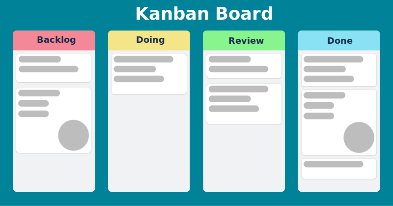

# Agile

Agile is a group of methodologies or habits for project management.

It's core premise is to break a project into phases to promote and emphasize collaboration. It's a structure where teams follow a cycle of planning, executing the plan, and evaluating the cycle.

Made by a group of developers in the early 1990's due to the frustrating and stifling methods of heavyweight/waterfall project management (which was very over regulated and micromanaged), the core principles of the Agile philosophy are outlined in the Agile Manifesto: [Manifesto for Agile Software Development](http://agilemanifesto.org/)

- **Individuals and interactions** over processes and tools.
- **Working software** over comprehensive documentation.
- **Customer collaboration** over contract negotiation.
- **Responding to change** over following a plan.

 

 

From this project management idealogy a number of agile frameworks we created. 

> Agile is the philosophy, the frameworks are a guide/process structure to perform the philosophy.

The top two most commonly used agile frameworks are:
- Scrum
- Kanban

Others you may come across:
- Lean
- Extreme Programming

 

# Scrum

[The Scrum Guide](https://scrumguides.org/scrum-guide.html)

An agile project management framework for teams to be organized and collaborate while continuously working on "living" products/projects.

Often a favorite framework by software development and engineering teams since software/applications are always growing, changing, and needing maintenance. 

## Scrum Team Roles
These role titles for individuals in Scrum team, are not the same as their job titles. These terms only describe each team members responsibilities with in the team.

### Development Team:
- The team on the Scrum team could be any member doing the work on the project: designers, writers, software engineers, UX/UI designers, QA testers, etc.
- Their responsibilities include: 
    - Delivering work throughout the sprint.
    - Meet up and openly communicate in the daily scrum/standup with the team members and scrum master.

### Scrum Master:
- The scrum master's role is the glue that holds together the team. They help define the goals, sprint, and acts as a servant leader of the team keeping them on track.
- Their responsibilities include:
    - Keeps communication and process as transparent as possible.
    - Coaches the team, define outcomes, and review outcomes.
    - Organization of self and team.
    - Ensuring the 5 Scrum values are upheld by the business and team for the teams stability and well-being: courage, focus, commitment, respect, and openness.

### Product Owner:
- The product owner understands and scopes the content with the customers and stakeholder in mind. They ensure the the scrum team is delivering and represents the business/organization's needs and opinions.
- Their responsibilities include:
    - Manage the scrum backlog.
    - Release management via the sprint planning cycle and sprint review.
    - Stakeholder management, communicating and working with those in management roles.

## Scrum Sprints
A **sprint** is the term for the current work cycle of a Scrum team. 

Sprints help teams take a complex project and break them down to bite sized manageable pieces/processes for the team to undergo. 

- Usually a 1-4 week time period.
- Makes projects more manageable.
- Allows teams to ship projects faster and more frequently.
- Most importantly: allows for more flexibility to adapt and change based on sprint to sprint project needs.
- Creates celebratory "goal" marks for the team, getting through a sprint helps developing feel more goal oriented and less monotonous. 

## Scrum Events 
The Sprint:
- Sprints, where ideas are turned into value.
- They are fixed length events(1-4 weeks) and a new Sprint starts immediately after the previous Sprint.
- All the work necessary to achieve the Product Goal, including Sprint Planning, Daily Scrums, Sprint Review, and Sprint Retrospective, happen within Sprints. (aka Sprint is the semi-ambiguous term for the time period where everything happens.)

Sprint Planning:
- Sprint Planning initiates the Sprint by laying out the work to be performed for the Sprint. This resulting plan is created by the collaborative work of the entire Scrum Team.
- Topic One: Why is this Sprint valuable?
- Topic Two: What can be Done this Sprint?
- Topic Three: How will the chosen work get done?

Daily Scrum:
- The Daily Scrum is a 15-minute event/meeting for the Developers of the Scrum Team. It is usually held at the same time and place every working day of the Sprint.
- The Daily Scrum focuses on progress toward the Sprint Goal and produces an actionable plan for the next day of work. This helps individual developers to focus and improves self-management.
- Daily Scrums improve communication, identify blockers/impediments, promote quick decision-making, and help eliminate the need for other meetings(which takes away time that could be used to work on the project).

Sprint Review:
- Review the sprint outcome and adapt for future sprints.
- Stakeholders and the Scrum Team review what was accomplished.
- They all collaborate for the next sprint's focus or add unfinished goals to the backlog. 

Sprint Retrospective:
- The purpose of the retrospective is to plan how to increase quality or effectiveness as individuals and/or a team. This is an important part of the process for the Scrum Team. 
- Together the team evaluates the Sprint with how individuals, processes, tools, and the overall communication/development went.
- Anything not accomplished will be added to the backlog for the next sprint and any suggested and agreed upon improvements will be practiced in the next sprint. 

 

Process Visualization:

 
 

# Kanban

[What is Kanban? Explained in 10 Minutes](https://kanbanize.com/kanban-resources/getting-started/what-is-kanban)

[Kanban Guide](https://kanbanguides.org/english/)

Kanban is more of a method versus a framework like Scrum.

Kanban is a Japanese work meaning "visual board" or "sign" and Kanban/ the Kanban Method was first developed by Toyota as a scheduling system for manufacturing. 

Kanban quickly spread to other commercial sectors like It, software engineering, etc. 

The Kanban system is managed and maintained via a [Kanban board](https://kanbanize.com/kanban-resources/getting-started/what-is-kanban-board) with at least three basic columns of:
- Requested
- In Progress
- Done

A well maintained and organized board make an amazing real-time system that's a snap shot of the status of a project.

 

 

## The 6 Core Kanban Principles
1. Start with what is done now: understanding the current workflow and processes.
2. Agree to pursue incremental, evolutionary change: preferring small incremental changes over large-scale overhauls.
3. Encourage acts of leadership at all levels: anyone on the team can suggest improvements not just leadership or managers.
4. Focus on customer needs and expectations: the Kanban method wants to incorporate client/customer needs and expectations to improve the quality of the product. 
5. Manage the work, not the workers: wants to empower team member roles and responsibilities to independently organize and delegate their work.
6. Regularly review the network of services: team members review and collaborate regularly to share ideas and opinions.

 

## Main Kanban Terms

[Kanban glossary](https://kanbanize.com/kanban-resources/getting-started/kanban-encyclopedia)
`*` the below terms are from this site 

- Kanban board:  A Kanban board is one of the Kanban method's key components and is where you visualize all work items. It should be divided into a minimum of 3 columns – Requested, In Progress, Done, representing different process stages.
- Kanban card: Kanban cards represent the different work items moving through a Kanban board. They contain important details about the tasks, such as description, deadline, size, assignees, etc. 
- Columns: They split the Kanban board vertically, and each of them represents a different stage of the workflow. Each Kanban board has 3 default columns: Requested, In Progress, Done. Depending on the complexity of a work process, these three stages can be divided into many smaller sub-columns.
- Swimlanes: Horizontal lanes that split a Kanban board into sections. Teams use them to visually separate different work types on the same board and organize homogenous tasks together.
- Cycle Time: Cycle time begins at the moment when a new task enters the “in progress” stage of your workflow, and somebody is actually working on it.
- Lead Time: Lead time starts at the moment a new task is being requested (it doesn’t matter if somebody is actually working on it) and ends with its final departure from the system.
- Throughput: The number of work items passing through (completed) a system or process over a certain period. The throughput is a key indicator showing how productive your team is over time.
- Work in Progress (WIP): This is the amount of work you are currently working on, and it is not finished yet.
- WIP limits: Limiting work in progress means limiting the number of tasks your team can work on simultaneously to avoid overburdening and context-switching.
- Classes of Service: Set of policies that help Agile teams prioritize work items and projects. 
- Kanban Cadences: Cyclical meetings that drive evolutionary change and “fit for purpose” service delivery. 
- Kanban software: Refers to a digital system that allows the practical application of the Kanban practices and principles to be used by various teams and organizations of all sizes. 

>  
>
> **A wonderful Kanban board site that is free:**
>
> [Trello](https://trello.com/home)
>
> [Trello Kanban Template](https://trello.com/templates/engineering/kanban-template-LGHXvZNL)
>
> Other options: [20+ Best Free Kanban Board Software Apps in 2023](https://clickup.com/blog/free-kanban-software/)
>
>  

 

